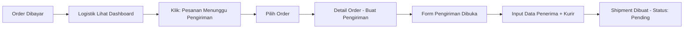
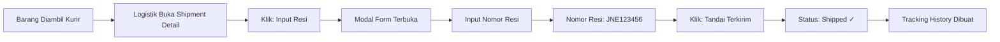

# 🚀 LOGISTICS SYSTEM - QUICK START GUIDE

## INSTALASI & SETUP

### Step 1: Jalankan Database Migration
```bash
php artisan migrate
# Ini akan membuat tabel: shipments dan shipment_trackings
```

### Step 2: Clear Cache (opsional tapi recommended)
```bash
php artisan config:cache
php artisan route:cache
```

### Step 3: Test di Browser
```
URL: http://localhost:8000/logistik/dashboard
```

---

## 📱 WORKFLOW PENGGUNAAN TERINTEGRASI

### Skenario 1: Order Selesai Pembayaran → Persiapan Pengiriman



### Skenario 2: Barang Siap Dikirim → Input Resi



### Skenario 3: Barang Sampai di Tangan Pelanggan → Konfirmasi Terima

```mermaid
graph LR
    A["Barang Tiba"] --> B["Logistik Check Status"]
    B --> C["Status: Shipped/In Transit"]
    C --> D["Klik: Konfirmasi Diterima"]
    D --> E["Modal Form Terbuka"]
    E --> F["Input Nama Penerima"]
    F --> G["Check: Tanda Tangan"]
    G --> H["Klik: Konfirmasi Penerimaan"]
    H --> I["Status: Delivered ✓"]
    I --> J["Order Status: Completed ✓"]
```



---

## 🎯 WAKTU ESTIMASI PER OPERASI

| Operasi | Waktu | Notes |
|---------|-------|-------|
| Dashboard Load | < 2s | Real-time KPI |
| List Orders | 1-2s | Dengan pagination |
| Create Shipment | 30-60s | Form + validation |
| Input Resi | 10-20s | Dialog modal |
| Konfirmasi Terima | 15-30s | Dialog modal |
| Generate Report | 2-5s | Aggregasi data |

---

## 🔍 TROUBLESHOOTING UMUM

### Q: Nomor resi tidak bisa disimpan (duplicate error)
**A:** Nomor resi harus unik. Cek di database jika sudah ada atau input nomor yang berbeda.

### Q: Order tidak muncul di list Pesanan
**A:** Order harus memiliki `payment_status = 'paid'` dan masuk dalam status allowed list.

### Q: Tombol "Input Resi" tidak muncul
**A:** Pastikan shipment status adalah 'pending'. Jika sudah 'shipped', tombol berubah menjadi "Konfirmasi Diterima".

### Q: Dashboard statistik tidak update
**A:** Jalankan `php artisan config:cache` lalu reload halaman. Database harus include juga.

### Q: Laporan tidak menampilkan data
**A:** Pastikan tanggal range benar. Query menggunakan `created_at` shipment, bukan `shipped_date`.

---

## 📊 DATABASE QUERIES YANG SERING DIGUNAKAN

```sql
-- Lihat semua shipment pending
SELECT * FROM shipments WHERE status = 'pending' ORDER BY created_at DESC;

-- Lihat total pengiriman bulan ini
SELECT COUNT(*) as total FROM shipments 
WHERE MONTH(created_at) = MONTH(NOW()) AND YEAR(created_at) = YEAR(NOW());

-- Lihat delivery success rate
SELECT 
    COUNT(*) as total,
    SUM(CASE WHEN status = 'delivered' THEN 1 ELSE 0 END) as delivered,
    ROUND(SUM(CASE WHEN status = 'delivered' THEN 1 ELSE 0 END) / COUNT(*) * 100, 2) as rate
FROM shipments
WHERE MONTH(created_at) = MONTH(NOW());

-- Lihat top courier
SELECT courier, COUNT(*) as total FROM shipments GROUP BY courier ORDER BY total DESC LIMIT 5;

-- Lihat tracking history untuk shipment
SELECT * FROM shipment_trackings WHERE shipment_id = ? ORDER BY tracked_at DESC;
```

---

## 🛡️ SECURITY & PERMISSIONS

Semua route logistik dilindungi dengan middleware:
```php
->middleware([RoleMiddleware::class . ':logistik'])
```

Hanya user dengan role 'logistik' yang bisa akses:
- ✅ Can view/create/edit shipments
- ✅ Can view orders
- ✅ Can generate reports
- ❌ Cannot modify order pricing
- ❌ Cannot access admin/finance features

---

## 📈 PERFORMANCE TIPS

1. **Indexing**: Database sudah punya index di:
   - `shipment_number`
   - `tracking_number`
   - `order_id`, `status`
   - `user_id`, `status`

2. **Query Optimization**: Controllers menggunakan:
   - `with()` untuk eager loading relationships
   - `paginate()` untuk pagination
   - `where()` clauses untuk filtering

3. **Caching** (Recommended untuk production):
   ```php
   // Di DashboardController bisa tambah:
   Cache::remember('logistics_stats', 3600, function() {
       // return stats
   });
   ```

---

## 🧪 TESTING ENDPOINTS DENGAN POSTMAN

### Login terlebih dahulu, kemudian:

```
1. GET /logistik/dashboard
   Response: Dashboard KPI data

2. GET /logistik/orders?search=ORDER-001
   Response: List orders dengan filter

3. GET /logistik/orders/123
   Response: Detail order

4. POST /logistik/shipments
   Body: {
     "order_id": 123,
     "courier": "JNE",
     "recipient_name": "Budi",
     "recipient_phone": "081234567890",
     "estimated_delivery": "2026-02-25"
   }
   Response: Shipment created

5. POST /logistik/shipments/1/mark-shipped
   Body: {
     "tracking_number": "00012345678",
     "courier": "JNE"
   }
   Response: Shipment marked as shipped

6. POST /logistik/shipments/1/mark-delivered
   Body: {
     "receiver_name": "Budi Santoso",
     "signature_received": true
   }
   Response: Shipment marked as delivered

7. GET /logistik/reports/delivery?start_date=2026-02-01&end_date=2026-02-28
   Response: Delivery report stats

8. GET /logistik/reports/shipment?start_date=2026-02-01&end_date=2026-02-28
   Response: Shipment statistics
```

---

## 📝 LOG PENTING

Cek log untuk debugging:
```bash
tail -f storage/logs/laravel.log
```

Fitur ini log:
- ✓ Shipment dibuat
- ✓ Resi diinput
- ✓ Penerimaan dikonfirmasi
- ✓ Status diupdate
- ✓ Validation errors

---

## 🎓 TIPS UNTUK OPTIMASI

### 1. Menggunakan Batch Operations (Future)
```php
// Insert multiple shipments sekaligus
Shipment::insertOrIgnore([...data array...]);
```

### 2. Real-time Dashboard Update
```javascript
// Bisa pakai JavaScript setInterval atau Livewire
setInterval(() => {
    fetch('/logistik/dashboard/stats')
        .then(r => r.json())
        .then(data => updateDashboard(data));
}, 30000); // Update setiap 30 detik
```

### 3. Export ke Excel
```php
// Tambahkan di controller:
Maatwebsite\Excel\Facades\Excel::download(...);
```

---

## 🚀 PRODUCTION CHECKLIST

- [ ] ✅ Database migrated
- [ ] ✅ Routes tested
- [ ] ✅ All pages accessible
- [ ] ✅ Forms validation working
- [ ] ✅ Reports generating data
- [ ] ✅ Permissions configured
- [ ] ✅ Error pages customized
- [ ] ✅ Logging enabled
- [ ] ✅ Backup database
- [ ] ✅ Monitor performance
- [ ] ✅ Train users
- [ ] ✅ Deploy to production

---

## 📞 SUPPORT & MAINTENANCE

### Regular Maintenance Tasks
- Monitor disk space
- Archive old shipment records (> 6 months)
- Review failed deliveries
- Analyze courier performance
- Update courier list if needed

### Monthly Tasks
- Generate compliance reports
- Audit all transactions
- Review user activity logs
- Update documentation

---

*Last Updated: 18 Feb 2026*
*System Version: 1.0*
*Status: PRODUCTION READY ✅*
